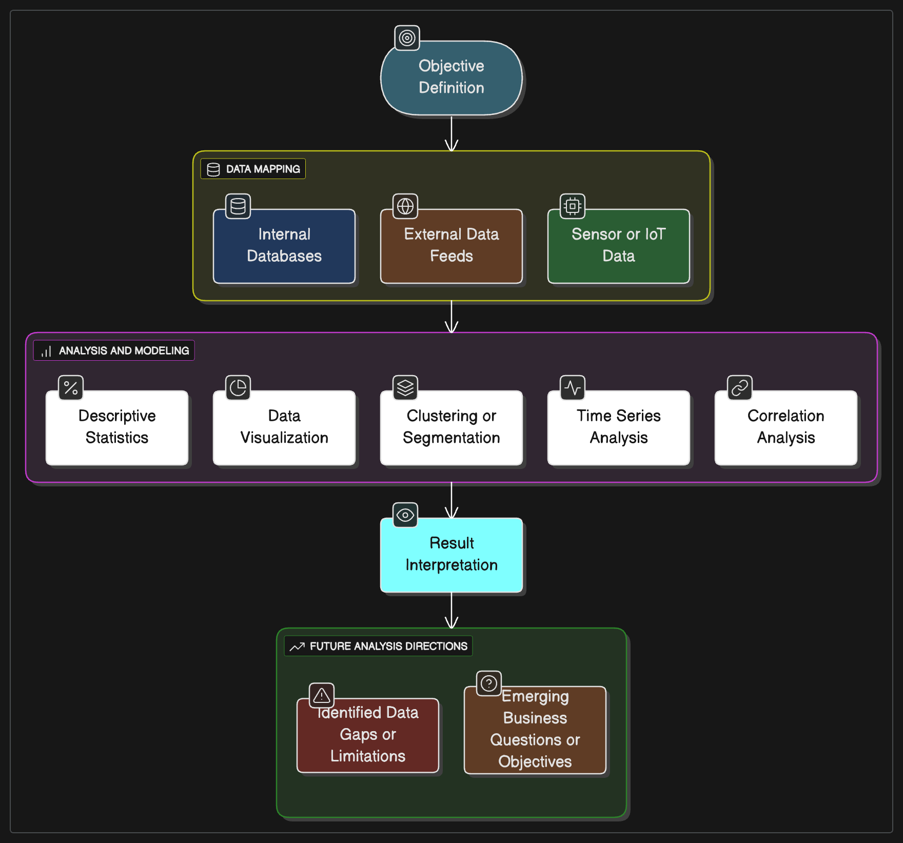

# Operational Data Analysis Preparation

## Overview
Preparing operational data for analysis is essential to ensure data quality, consistency, and relevance. Proper preparation enables accurate insights, reduces errors, and facilitates effective decision-making. By cleaning, transforming, and validating data, organizations can maximize the value derived from their operational datasets.

## Key Steps in Operational Data Preparation
1. Source Identification
   - Identify the sources of operational data, such as databases, APIs, or flat files.
   - Ensure that the data sources are reliable and up-to-date.
2. Period Identification
   - Define the time periods for which data will be collected and analyzed
3. Objective Definition
   - Clearly define the objectives of the analysis task in terms of what business questions need to be answered. Sometimes it is some user behavior or property that you want to understand better. Sometimes instead of a user behavior it is a business metric (demand, inventory levels) or physical metric (air quality, temparature, wind-speeds, amount or solar radiation) that you want to understand better. The objective should be specific, measurable, achievable, relevant, and time-bound (SMART). This is important to ensure that the data preparation aligns with the intended analysis
4. Data Analysis Mapping
    - Define the data analysis tasks that will be performed on the data and how the results will be used. This step should be aligned with the objectives defined in the previous step.
    - Clearly document the type of data that is being analyzed - is it cross-sectional, time series, or panel data?
    - Identify what statistical characteristics you are looking to uncover in the data in relation to the business outcomes. 
      - To start with clearly define the attributes in dataset that are relevant to the analysis.
      - Understand how these are distributed in the data.
      - Decide if an IID approach is appropriate or if you need explicitly account hetrogeneity and correlation in the data. As dataets get bigger, IID is increasingly not a good assumption. Hetrogeneity and concentration of values usually are observed in real-world datasets.

Usually the above steps will result in the following implementation steps:

1. Filtering a time period of interest
2. Filtering a set of attributes of interest
3. Computing derived attributes
4. Aggregating data to a desired level of temporal granularity - some sort of grouping operation

## Descriptive Data Analytics

Once the data is prepared, descriptive analytics can be performed to summarize and understand the data. The tasks performed depend on the objectives defined earlier.

## Result Interpretation
After the analysis, it is crucial to interpret the results in the context of the defined objectives. This involves:
- Evaluating whether the analysis answered the business questions.
  
- What insights were gained from the data.
  
- Identifying any limitations or assumptions made during the analysis.
  
- Considering the implications of the findings for business decisions or further research.

## Defining Next Steps
Based on the results and interpretations, define the next steps:

{fig-align=center}

### Note
The descriptive analytics tasks in the above diagram are not exhaustive. The specific tasks will depend on the objectives defined earlier. These are just examples of common tasks that can be performed.
