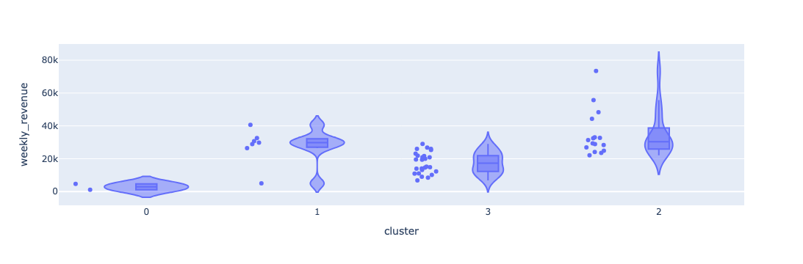
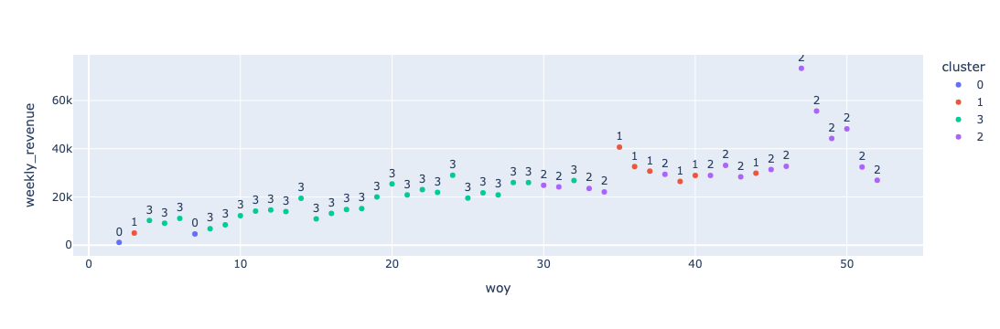

## Temporal Analysis of Purchase Behavior in SP during 2017

This note is a brief overview of temporal clustering analysis of frequently purchased items in Sao Paulo during the year 2017. Two primary behaviors are analyzed:
1. **Cosine Similarity Clustering**: This approach uses cosine similarity to identify clusters of weeks with similar product purchase behavior.
2. **Euclidean Similarity Clustering**: This approach uses euclidean distance to identify clusters of weeks with similar amounts of revenue generated from product purchases.
### Implementation Sketch
The approach to analysis is based on [this approach document](https://github.com/rajivsam/descriptive_analytics/blob/main/examples/olist_case_study/approach_to_analysis.md). The implementation of revenue segmentation is based on the recipe described in the [concept discussion for operational data](https://github.com/rajivsam/descriptive_analytics/blob/main/concept_discussion/operational_data_prep.md). The key steps include:

1. Defining the datasource: The datasource is daily orders data prepared as part of revenue segmentation analysis. 
2. Objective Identification: There are two behaviors we want to isolate:
   1. Identify clusters of weekly purchases that are similar in terms of what products are purchased. This is done using cosine similarity.
   2. Identify clusters of weekly purchases that are similar in terms of the amount of revenue generated from product purchases. This is done using euclidean distance.

3. Data Analysis Mapping: The daily transaction data is filtered to include only orders from Sao Paulo during 2017. A pivot table is created to summarize the purchase behavior, where each row represents a week of year and each column represents a product. The values in the table is weekly revenue for each product. The cosine similarity and euclidean distance are computed for the pivot table to compute the cosine similarity matrix and the euclidean similarity matrix, respectively. The cosine similarity matrix is used to identify clusters of weeks with similar product purchase behavior, while the euclidean similarity matrix is used to identify clusters of weeks with similar amounts of revenue generated from product purchases.
   

4. Descriptive Analytics:
   1. Cosine Similarity Clustering: 
    - A heat map is used to analyze the clustering of similar buying behavior.
    - A review of the diagonal of the heatmap and its correlation with the color scale indicating the correlation strength shows 3 distinct clusters of weeks where buying behavior is similar. You can make an argumnet for 4 clusters depending on the strength of the correlation you want to capture.
    - Spectral clustering is used to identify the clusters of similar buying behavior. The number of clusters is set to 3.
    - A violin plot is used to visualize the distribution of weekly revenue for each cluster. The plot shows that the clusters are distinct in terms of the distribution of weekly revenue.
    - A scatter plot is used to visualize the clusters in a 2D space. The scatter plot shows that the three clusters seem to correspond to after holiday, regular, and pre-holiday buying behavior.
    2. Euclidean Similarity Clustering:
    - A histogram of euclidean similarity is used to analyze the clustering of similar buying behavior. The histogram shows two distinct bins, indicating that the clusters are distinct in terms of the distribution of weekly revenue.
    - Spectral clustering is used to identify the clusters of similar buying behavior. The number of clusters is set to 2
    - A violin plot is used to visualize the distribution of weekly revenue for each cluster. The plot shows that the clusters are distinct in terms of the distribution of weekly revenue.
    - A scatter plot is used to visualize the clusters in a 2D space. The scatter plot shows that the clusters are distinct in terms of the distribution of weekly revenue.

5. Result Interpretation: 
   1. A heatmap of cosine similarity of weekly purchase behavior in Sao Paulo during 2017 shows three distinct clusters of weeks where buying behavior is similar. You can make an argument for 4 clusters depending on the strength of the correlation you want to capture. Please view the diagonal of the heatmap and its correlation with the color scale indicating the correlation strength to identify the clusters.
   for the visualization.
    2. A violin plot of weekly revenue for each cluster shows that the clusters are distinct in terms of the distribution of weekly revenue.
     for the visualization.
    3. A scatter plot of the clusters in a 2D space shows that the three clusters seem to correspond to after holiday, regular, and pre-holiday buying behavior.
     for the visualization.
    4. The histogram of euclidean similarity shows two distinct bins, indicating that the clusters are distinct in terms of the distribution of weekly revenue.
     for the visualization.
    5. The clusters are distinct in terms of the distribution of weekly revenue, as shown in the violin plot.
     for the visualization.
    6. The clusters are distinct in terms of the distribution of weekly revenue, as shown in the scatter plot.
     for the visualization.

## Code Details
1. The code for the data preparation and analysis is available in [data_prep_prod_purchase_analysis.ipynb](https://github.com/rajivsam/descriptive_analytics/blob/main/notebooks/data_prep_prod_purchase_analysis.ipynb).
2. The code for the cosine similarity descriptive analytics is available in [cs_analysis_prod_purch_2017.ipynb](https://github.com/rajivsam/descriptive_analytics/blob/main/notebooks/cs_analysis_prod_purch_2017.ipynb).
3. The code for the euclidean similarity descriptive analytics is available in [ed_analysis_prod_purch_2017.ipynb](https://github.com/rajivsam/descriptive_analytics/blob/main/notebooks/ed_analysis_prod_purch_2017.ipynb).

## Next Steps
1. Understand temporal segmentation of purchase behavior in Sao Paulo during 2017 from the perspective of weekly revenue at the store. This is based on the euclidean similarity.
2. Profiling the temporal clusters identified in this step to understand the characteristic components of each cluster. This will take more than one analysis technique. For example, we can use a NMF or a topic model to summarize the segments. We can then use submodular optimization techniques to generate succinct profiles for each segment. The cosine similarity clustering suggests that some columns (products) have affinities for some rows (weeks). Biclustering is a good technique to identify these affinities. We can use the biclustering technique to identify the representative products for each segment. This also a good analysis to understand which products customers prefer at different times of the year.

