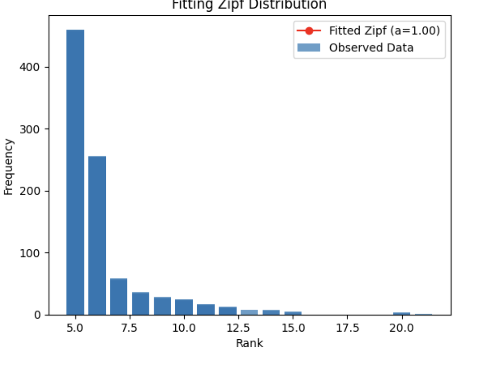
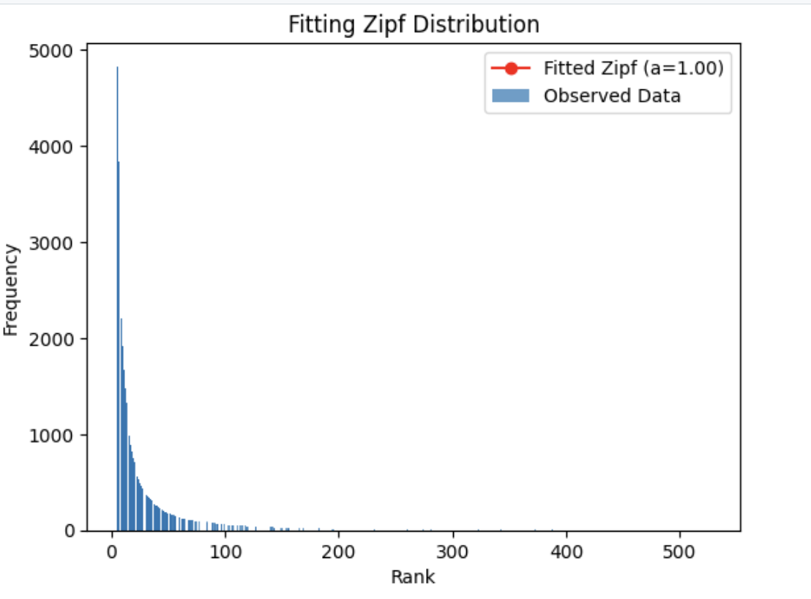

## Revenue Segmentation by Customers and Products

This note is a brief overview of the revenue segmentation analysis performed on the Olist dataset. The analysis focuses on understanding how revenue is distributed across different customer segments and product categories.

### Implementation Sketch
The implementation of revenue segmentation is based on the recipe described in the [concept discussion for operational data](https://github.com/rajivsam/descriptive_analytics/blob/main/concept_discussion/operational_data_prep.md). The key steps include:

1. Defining the datasource: Kaggle provided the Olist dataset. A schema is also provided to understand the structure of the data. The data can be downloaded from the [Olist Kaggle page](https://www.kaggle.com/datasets/olistbr/brazilian-ecommerce).
2. Objective Identification: This exercise aims to understand customers and product purchase behavior have contributed to the revenue generated by Olist.
3. Data Analysis Mapping: The schema information is used to identify the relevant attributes for the analysis. The focus is on customer and product attributes that are relevant to revenue segmentation.
4. Descriptive Analytics: The data distribution for repeating customer visits and repeating product purchases is analyzed. The analysis includes:
   - Identifying a candidate distribution by analyzing the histogram of the data.
   - Customer repeat visits and product repeat purchases follow a distribution similar to what is observed in word frequency analysis in text analytics.
   - Fitting a Zipf distribution to the data.
   - Verifying the fit with a goodness-of-fit test.
   - Computing the percentage of revenue generated by repeating customers and products.

5. Result Interpretation: 
   1. Repeat customers follow a Zipf distribution, indicating that a small number of customers are loyal to the store.
   
    2. Repeat product purchases also follow a Zipf distribution, indicating that a small number of products contribute significantly to the revenue.
   
    3. Repeat product purchases contribute more to the revenue than repeat customer visits. So managing inventory and product availability is crucial for maximizing revenue (need to avoid stockouts).
   

## Code Details
1. The code for the data preparation and analysis is available in [data_prep_olist.ipy](https://github.com/rajivsam/descriptive_analytics/blob/main/notebooks/data_prep_olist.ipynb).
2. The code for the descriptive analytics is available in [customer_product_segmentation.ipynb](https://github.com/rajivsam/descriptive_analytics/blob/main/notebooks/customer_product_segmentation.ipynb).

## Next Steps
Understand revenue segmentation by geography and time periods. This will help in understanding how revenue is distributed across different regions and time periods, which can provide insights into customer behavior and product demand patterns.

[def]: ../../images/perf_summary_seg_cust_prod.png