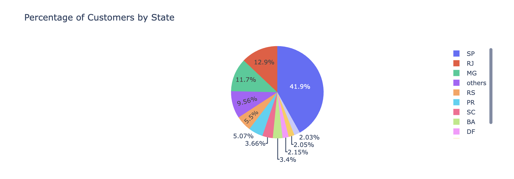

## Overview
This note provides a brief overview of the revenue segmentation analysis performed on the Olist dataset, focusing on how revenue is distributed across different geographical regions. The analysis aims to understand customer behavior and product demand patterns in various locations.

## Implementation Sketch
The approach is again based on the recipe described in the [concept discussion for operational data](../concept_discussion/operational_data_prep.md). The key steps include:

1. **Defining the datasource:** The dataset is the orders dataset that was produced as part of the previous analysis. The dataset contains information about customer orders, including order IDs, customer IDs, product IDs, and geographical details.
2. **Objective Identification:** The objective is to understand how revenue is distributed across different geographical regions, which can provide insights into customer behavior and product demand patterns.
3. **Data Analysis Mapping:** The schema information is used to identify the relevant attributes for the analysis. Various geographical attributes such as state, city, and zip code are available in the dataset, which can be used to segment revenue by geography. In this analysis we will focus on the state level.
4. **Descriptive Analytics:** The data distribution for revenue by geography is analyzed. The analysis includes:
   - Aggregating number of orders and customers by state.
   - Visualizing the distribution of revenue across different states.
   - Identifying states that contribute significantly to the overall revenue.

5. **Result Interpretation:**
   - The analysis reveals that certain states contribute significantly to the number of orders, customers, and revenue.
  
  

  Orders and customers are concentrated in a few states, indicating that these regions are key markets for Olist. Sao Paulo (SA) seems to be the most significant contributor.

6. Code Details:
   - The code for the data preparation and analysis is available in [geographic_seg_prep.ipynb]([../notebooks/geographic_seg_prep.ipynb](https://github.com/rajivsam/descriptive_analytics/blob/main/notebooks/geographic_seg_prep.ipynb)).
   - The code for the descriptive analytics is available in [geo_seg_plots.ipynb](https://github.com/rajivsam/descriptive_analytics/blob/main/notebooks/geo_seg_plots.ipynb).

## Next Steps
Complete segmentation by time periods. This will help in understanding how revenue is distributed across different time periods, which can provide insights into seasonal trends and customer purchasing behavior over time.