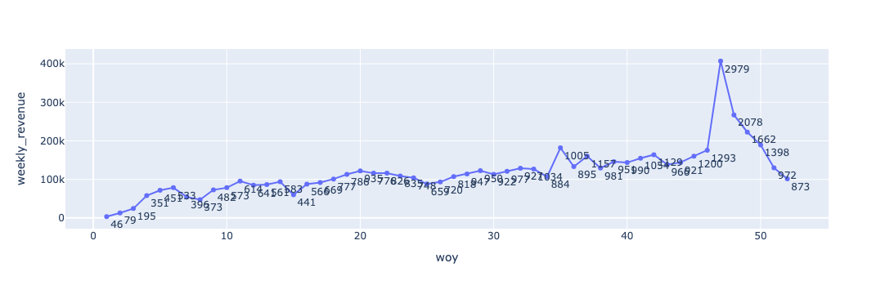
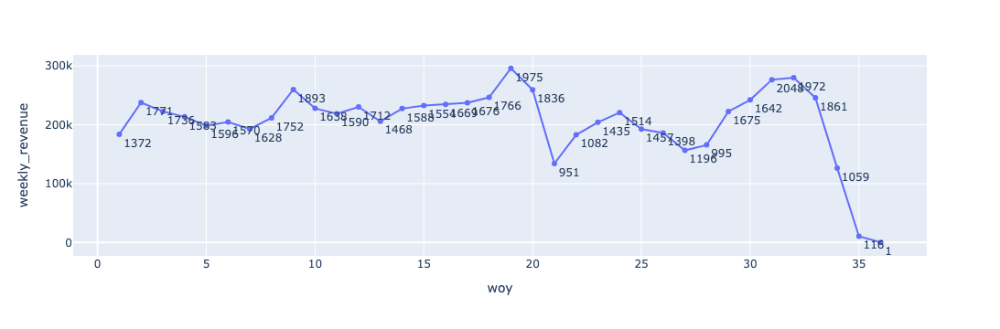
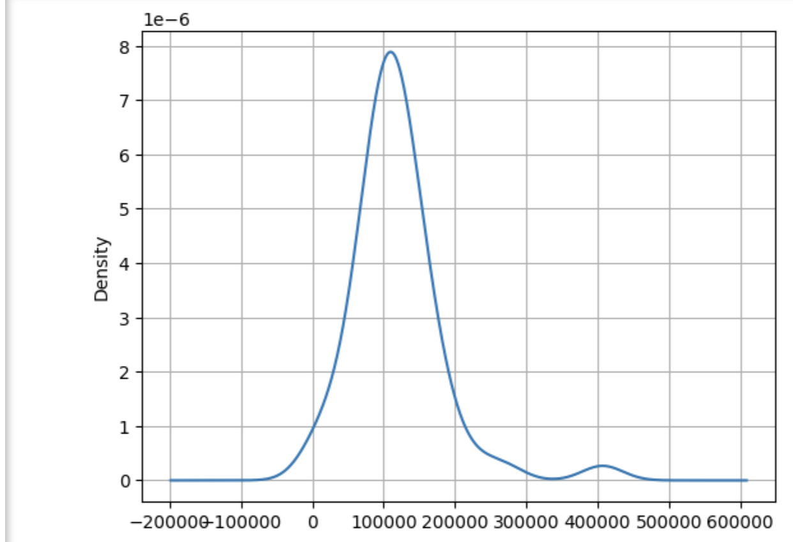

## Overview
This note provides a brief overview of the revenue segmentation analysis performed on the Olist dataset, focusing on how revenue is distributed across different temporal periods. The analysis is part of the Olist case study, which aims to understand customer behavior and product demand patterns through descriptive analytics.

## Implementation Sketch
The approach is again based on the recipe described in the [concept discussion for operational data](../concept_discussion/operational_data_prep.md). The key steps include:

1. **Defining the datasource:** The dataset is the orders dataset that was produced as part of the previous analysis. The orders dataset is aggregated on a weekly cadence. This is a reasonable cadence for the Olist dataset, as it allows for a good balance between granularity and planning horizon. 

2. **Objective Identification:** The objective is to understand how revenue is distributed across different geographical regions, which can provide insights into customer behavior and product demand patterns.
3. **Data Analysis Mapping:** The schema information is used to identify the relevant attributes for the analysis. As part of the data preparation, the year, month, and week of the order date are extracted from the order date. The revenue is aggregated by year and week to create a weekly revenue dataset. The weekly revenue and the number of orders per week are also calculated. 
4. **Descriptive Analytics:** 
    - The time series of weekly revenue is plotted to visualize the revenue trends over time for each of the years in the dataset.
    - The number of orders per week is also plotted to visualize the order trends over time for each of the years in the dataset.
    - A histogram of the weekly revenue is plotted to check if there is a changes in the distribution of revenue over time. If the histogram is multimodal, it indicates that there are different patterns of revenue distribution over time. We can run a change point detection algorithm to identify the points in time where the distribution of revenue changes significantly. This is not done in this analysis, but it is a potential next step. You can check out this [blog post](https://rajivsam.github.io/r2ds-blog/posts/hmm_r8/) for more details on how to do this.
5. **Result Interpretation:**
    - 2016 does not have enough data to be included in the analysis, it is missing about 10 weeks of data and it starts late in the year, you can't really reliably interpret the results for that year.
    - 2017 is the first full year of data, and it shows a steady increase in revenue over time. It shows one change point perhaps due to the holiday season in December.
  
    - 2018 also is a partial year, but it looks like it has a similar pattern to 2017.
  
    - The histogram of weekly revenue shows two modes, one large and one small. A change point detection algorithm can isolate the the time of change.
  

## Code
   - The code for the data preparation and analysis is available in [temporal_data_prep.ipynb](https://github.com/rajivsam/descriptive_analytics/blob/main/notebooks/temporal_data_prep.ipynb).
   - The code for the descriptive analytics is available in [temporal_seg_plots.ipynb](https://github.com/rajivsam/descriptive_analytics/blob/main/notebooks/temporal_seg_plots.ipynb).

## Next Steps
Given that we know there are three states SP, MG and RJ, is where most of orders come from and that we have a full good set of data for 2017 and some good data for 2018, we can do a more detailed analysis of the revenue distribution across these states in terms of product categories. We can create two product category segments, one for the frequent categories and one for the infrequent categories. The frequent categories are those that have a high number of orders and a high revenue, while the infrequent categories are those that have a low number of orders and a low revenue. This will allow us to understand how the revenue is distributed across different product categories and how it changes over time in each of the states.

*note* 
Please see the [summary of the revenue analysis](summary_revenue_analysis.md) for a summary of the revenue analysis performed on the Olist dataset. The summary includes the key findings from the analysis and the next steps for further analysis.