# The Olist Dataset: Picture Summary for the Sau Paulo Region (SP) in 2017

### Why Sau Paulo (SP)?
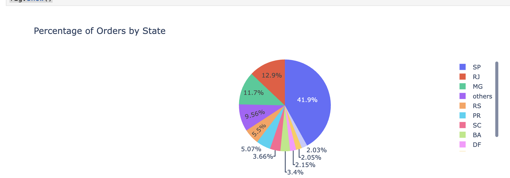
When we look at the distribution of Olist orders by state, we see that Sau Paulo (SP) accounts for a significant portion of the total orders. This makes it a key region for analysis. RJ and MG follow, but SP stands out with a substantial lead in the number of orders.

**code**:
[customer_product_segmentation.ipynb](../../notebooks/customer_product_segmentation.ipynb)

### Why 2017?
2017 is the year where we have the most complete data available. We have data for the later part of 2016 but it is missing 10 weeks of data. We have data that is continuous for 2018, but it is for part of the year only. Therefore, 2017 is the best choice for a complete analysis of customer behavior and sales trends.
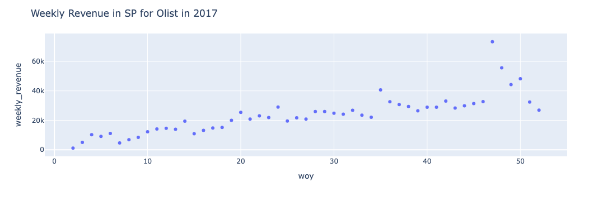

**code**:
[temporal_seg_plots.ipynb](../../notebooks/temporal_seg_plots.ipynb)

### How similar were weekly orders from Olist in SP in 2017?
The cosine similarity is used to answer the question. To recap the cosine similarity, it is a measure of similarity between two non-zero vectors. It has high values when the vectors have the same components and the components are different. In a two dimensional vector, you have the x and the y component, for example. A weekly order is a vector of revenues from sales of inventory items that week. The components of the vector are the inventory items. The magnitude of the component is the amount revenue from the sale of that inventory item for the week. If we examine the cosine similarity of successive weeks of orders in SP, we can get a sense of similarity of the inventory items that were ordered in these weeks. 

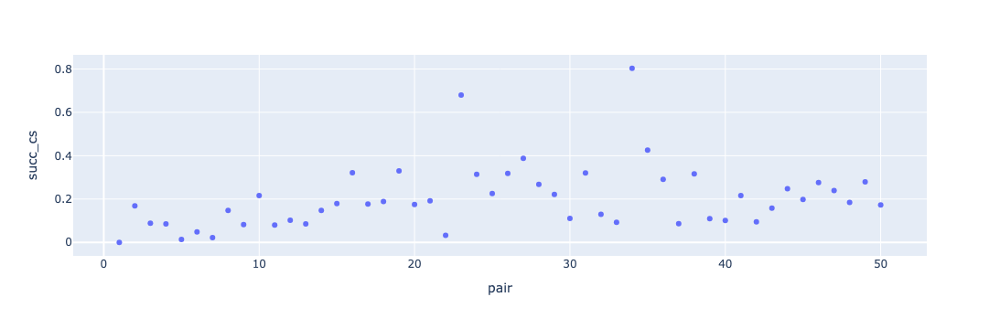

The cosine similarity of the weekly orders in SP in the first half of 2017 is lower than the cosine similarity of the weekly orders in the second half of 2017. This suggests that the inventory items ordered in the first half of 2017 were more diverse than those ordered in the second half. There are some periods of high cosine similarity. The reason for this needs to be investigated further, but it could be due to seasonal trends or specific promotions that led to similar purchasing patterns.

**code**:
[cs_analysis_prod_purch_2017.ipynb](../../notebooks/cs_analysis_prod_purch_2017.ipynb)

### Why are we looking at weekly orders?
When we exmanined what drives revenue to the store, we found that frequent purchases of a small number of items contribute most to the revenue. 

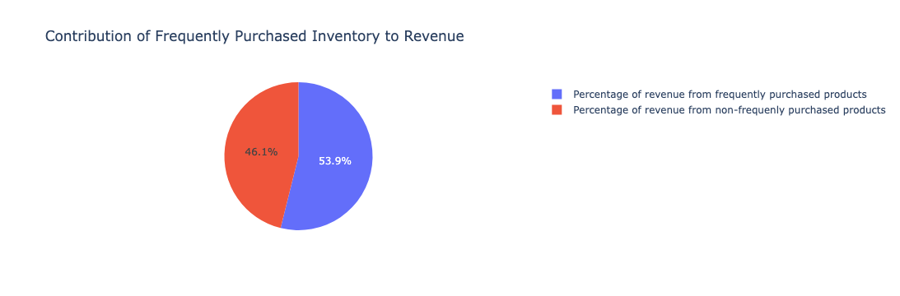

**code**:
[customer_product_segmentation.ipynb](../../notebooks/customer_product_segmentation.ipynb)

### What is a frequently purchased item and what portion of the inventory is it?
A frequently purchased item is one that was purchased 10 or more times in the period for which we have data. This is a very low threshold, but as we can see, it is still a very small portion of the inventory. 

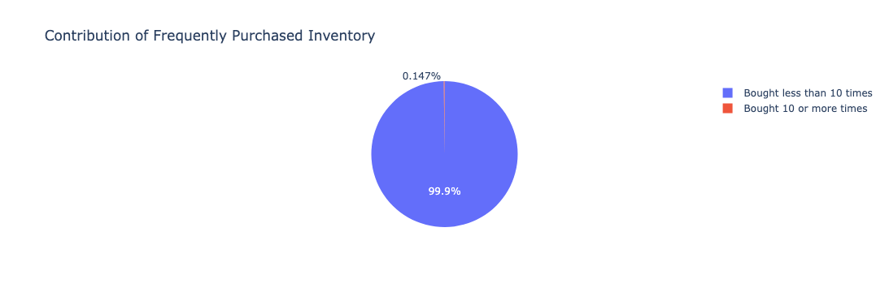

**code**:
[customer_product_segmentation.ipynb](../../notebooks/customer_product_segmentation.ipynb)

### Why are we not looking at frequent customers?
Because frequent customers, those who have made 5 or more purchases at the store contribute a very small portion of the revenue in contrast to frequently purchased items.
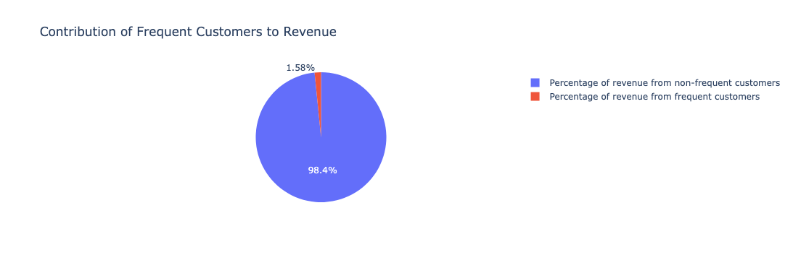

This does not mean that frequent customers are not important, just that since frequent items are a much larger portion of the revenue, we will focus on them for this analysis.

### Can you summarize the weekly orders in SP in 2017 into smaller segments?
Yes, clustering the cosine similarity graph of the weekly orders in SP gives us that.

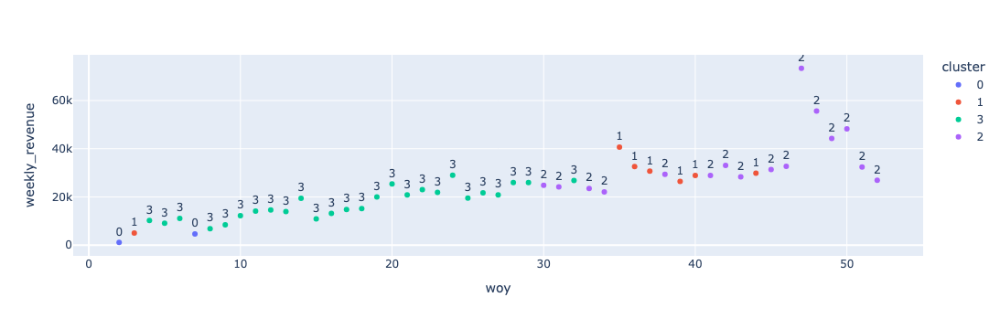

The weekly revenue for the clusters is shown in the violin plot below. 
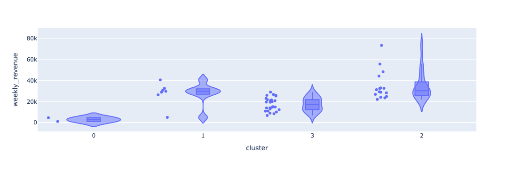

**code**:
[cs_analysis_prod_purch_2017.ipynb](../../notebooks/cs_analysis_prod_purch_2017.ipynb)

### Ok, how about summarizing the frequent items ordered, there are nearly 3k inventory items that are ordered frequently. Can these be summarized?

We achieve this by applying Non-negative Matrix Factorization (NMF) to the weekly orders in SP. NMF is a dimensionality reduction technique that summarizes high-dimensional data into a smaller set of interpretable components. In this case, the weekly orders can be effectively represented by just two distinct components, each characterized by a unique set of inventory items. For a clear explanation of the separable NMF concept, see [this talk](https://www.youtube.com/watch?v=O8YDAMjIzYs&t=1443s); for a deeper dive, refer to [Ankur Moitra's talk](https://www.youtube.com/watch?v=kSfwY68gQ9I&t=1647s). In matrix factorization, these defining items are known as "anchor items." Remarkably, these two components capture 90% of the variance in weekly orders for SP. The first component contains 34 unique inventory items, while the second has 104. Item descriptions are in Portuguese. Below is a sample of items from each component. Note these are item descriptions/categories. Two different inventory items can have the same descriptions. A set difference is used to determine the items in each component that are not in the other component. Please refer to the implementation.

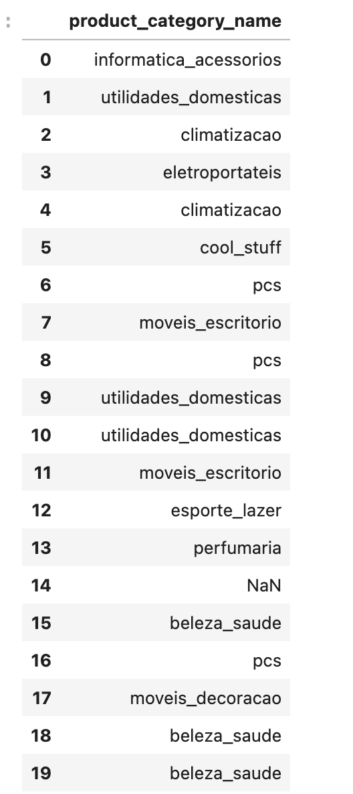  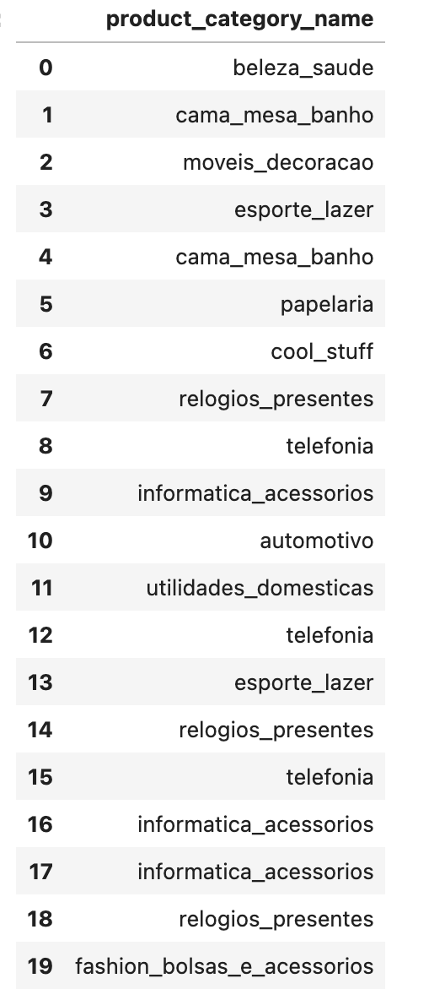 

Now each week can be succintly described by just two components (instead of nearly 3 K components). Each component has a unique signature profile.

**code**
[sep_nmf_cs_temp_2017_purch_data.ipynb](../../notebooks/sep_nmf_cs_temp_2017_purch_data.ipynb)

### What is similar when you are looking at frequently purchased items using cosine similarity?
Well, this is an analysis choice. It is a choice using which you can pivot your analysis into different sub-problems. For example if you decide that items with lessn than 10 percent cosine similarity are not similar, then this threshold will connect items that are similar and disconnect items that are not similar. 

In the temporal segmentation of weekly inventory items, we connect two weeks if their cosine similarity is greater than 0.1. This threshold requires analysis and tuning. Alternatively, you can pick a set of nearest neighbors for each point in your dataset. So this will segment your similarity graph into connected components. The connected components will be the weeks that are similar to each other. An example of this is illustated in the geographical segmentation of the weekly inventory items. The idea can be extended to temporal view also. Each connected component will be a sub-problem that can be analyzed separately. You typically want to analyze some signal on the sub-graphs, such as the number of orders, the revenue, or the number of unique items ordered. 

**code**:
1. [knn_graph_prep.ipynb](../../notebooks/knn_graph_prep.ipynb)

2. [geo_cs_analysis_prod_purch_2017.ipynb](../../notebooks/geo_cs_analysis_prod_purch_2017.ipynb)

### How was the ordering behavior in SP across different cities in the year 2017?
Just a quick description of the way this segmentation was done. In contrast to aggregating the weekly orders, we are looking at the orders in each city in SP. On a side note, this aggregation of a raw transaction dataset with respect to a small number of attributes is a common pattern in data analysis. 

The similarity graph for weekly orders computes the similarity of ordering behavior across different weeks of the year 2017. In contrast, the similarity graph for cities computes the similarity of ordering behavior across different cities in SP. 

In addition, the thresholding idea discussed above is applied to the similarity graph for cities. The threshold is set to 0.3, which means that cities with a cosine similarity greater than 0.1 are connected by an edge in the graph. The connected components of the graph are the cities that are similar to each other in terms of ordering behavior. _The non singleton connected components are also subsets of the dataset where the IID assumption is not reasonable . The singleton connected components can be analyzed and modeled in isolation from the other data points, i.e, the IID assumption is reasonable for these points. The singleton compnents are those points, weeks or cities, depending on what aggregation you are analyzing, that are not connected to any other point. Knowing what cannot be treated as IID and what can be is a very useful finding. You have partitioned the original dataset into a part where the IID assumption cannot be made and a part where it can be made._. Each connected component can be analyzed according to the problem you are investigating, for example it could be a signal of some kind on a graph, revenue for example. It could be a discrete property, is the city a high sales volume city? You may be interested in clustering within a connected component. [Ulkrike von Luxborg's tutorial on Spectral Clustering](https://people.csail.mit.edu/dsontag/courses/ml14/notes/Luxburg07_tutorial_spectral_clustering.pdf) is a very popular resource. It is also an excellent resource. As discussed in the tutorial, you can generate the similarity graph by picking a fixed number of neighbors for each node instead of applying a threshold. This is another variation of parametrizing the size of the similarity graph.

Using a threshold of 0.4 for connecting two nodes of the similarity graph of the cities in Sau Paulo, we have 56 connected components. The largest one has 26 edges. The number of subgraphs in the connected components and thier respective sizes are shown in the table below.

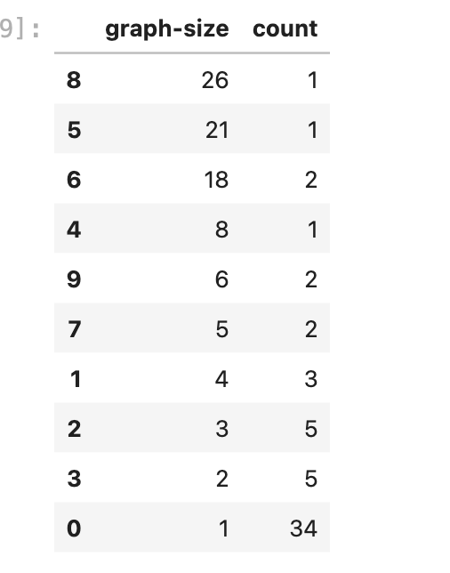

A subgraph of size 26 is shown below

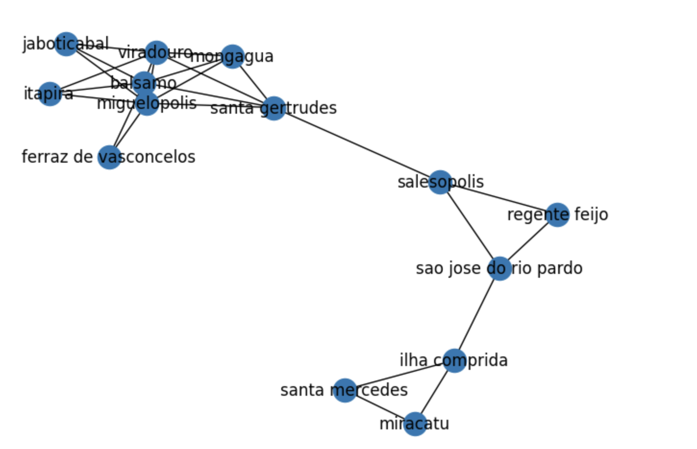

**code**:

[geo_cs_analysis_prod_purch_2017.ipynb](../../notebooks/geo_cs_analysis_prod_purch_2017.ipynb)

### Are we done with analyzing the Olist dataset?
No, to get the full picture, you need to repeat the analysis for:
1. RJ
2. MG
3. A combined set of all other states, because after the top 3 states, the data is very thinly spread across the other states. It makes more sense to just bucket these together.

The analysis should be similar to what was done for SP. To get the full picture, we combine the results from these analyses. 

### Concluding thoughts

Hopefully, this convinces you that, performing a descriptive analytics task like the above on this dataset is useful because it gives you information about how your problem is structured. The connected components of the similarity sub-graph does this for us. Personally, I prefer doing an analysis like this prior to a related task like forecasting revenue or understanding revenue through a graph regression model.

